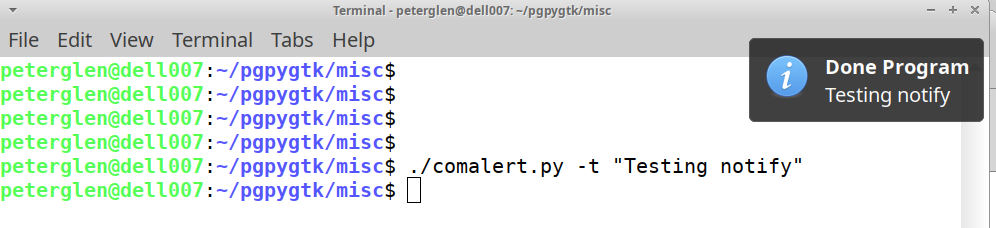

# Misc python gadgets

## For system monitoring etc ...

### comalert.py

 Alert when a shell command terminates by displaying notification. Also play
a sound and / or beep.

    usage: comalert.py [-h] [-v] [-n] [-f FILESOUND] [-o TIMEOUT] [-l TMINLEN]
                       [-e TITLE] [-t] [-s]
                       [argx ...]
    Monitor programs terminating in (bash) shell. Notify and play sound.

    positional arguments:
      argx                  Arguments, context dependent

    options:
      -h, --help            show this help message and exit
      -v, --verbose         Show operational details. Add more -v for more
                            details.
      -n, --nosound         Switch off sound alerts.
      -f FILESOUND, --filesound FILESOUND
                            File name for sound. Default is "complete.oga"
      -o TIMEOUT, --timeout TIMEOUT
                            Notification window timeout in seconds. Zero for no
                            timeout. Default is 10 sec.
      -l TMINLEN, --tminlen TMINLEN
                            Time the program must be running (in seconds) for
                            notify to kick in. Default is 30 sec.
      -e TITLE, --title TITLE
                            Title line of the notification field. Default: "Done
                            Program"
      -t, --testalert       Test notifier. Command line args are used as
                            notification.
      -s, --testsound       Test sound.

 The test option can also be used as a notification driver. The command line
arguments are fed into the notifier text. With the -e option one can specify a header
for the notification. For example:

    comalert.py -t -e "Notification Header" "Notification Body"

## ScreenShot of notify (on xfce4):

One may run the ./comalert.py from the command line, (./comalert.py & for background)
or as a startup item in .bashrc ... etc

## Algorithm used for monitoring:

 The running shell program entries (bash entries) are collected with the psutil module.
The programs that have a shell as a parent are then listed. If that list looses a member,
it means that program has finished. An alert / notification is triggered.

### powtest.py

 Print large power consumer processes in a loop

    CPU 77.2

    CPU 87.7
    2024/11/11 11:23:09 136725   6% /usr/lib/xorg/Xorg
    2024/11/11 11:23:09 145458   8% /usr/bin/python3.10
    2024/11/11 11:23:09 152276  70% /usr/bin/baobab
    2024/11/11 11:23:09 154916  72% /usr/local/bin/node

    CPU 77.5
    2024/11/11 11:23:41 136725   7% /usr/lib/xorg/Xorg
    2024/11/11 11:23:41 145458   5% /usr/bin/python3.10
    2024/11/11 11:23:41 152276  79% /usr/bin/baobab

### nettest.py

 Print network stats in a loop

    Date                  Sent    Rec   IF
    2024/11/11 11:14:47      1      3   wlp1s0
    2024/11/11 11:14:51      6      7   wlp1s0
    2024/11/11 11:14:53      2      2   lo
    2024/11/11 11:14:53     86    209   wlp1s0
    2024/11/11 11:14:55      2      2   wlp1s0
    2024/11/11 11:14:57      0      1   wlp1s0

### iotest.py

  Print lagging IO transactions. This helped troubleshooting short freezes.

    ./iotest.py
    read:
    ead: [
    read: C
    read:
    ead: [
    read: C
    read:
    ead: [
    read: A
    read:

### guitest/

  Some pyGtk (pyGobject) tests

### mathtest/

  Algorithms for math constants e and pi -- (just a test)

// EOF
